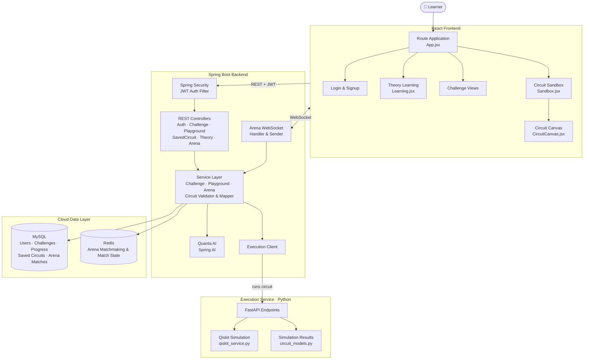

<div align="center">

# ⚛️ QubitQuest

### AI-Based Interactive Quantum Algorithm Learning Platform

**Learn → Practice → Build → Debug → Experiment → Compete**


[🎥 Demo Video](https://youtu.be/3fcT0MJd3mg) • [📂 Repository](https://github.com/jayendra-877/QubitQuest)

</div>

---

## Table of Contents

- [Problem Statement](#problem-statement)
- [Our Solution](#our-solution)
- [Key Features](#key-features)
- [Innovation & Uniqueness](#innovation--uniqueness)
- [System Architecture](#system-architecture)
- [Tech Stack](#tech-stack)
- [Repository Structure](#repository-structure)
- [Getting Started](#getting-started)
- [Future Scope](#future-scope)
- [Team Q-Six](#team-q-six)
- [References](#references)

---

## Problem Statement

Quantum computing is a strategic priority under India's **National Quantum Mission**, creating a growing need for students and engineers who can work with quantum algorithms. However, learning quantum computing remains difficult and highly theoretical for most engineering students.

- Students learn through textbooks, research papers, lectures, or fragmented online tools.
- Physical quantum hardware is expensive and inaccessible to most institutions.
- Existing simulators focus on circuit execution rather than a **complete learning journey**.
- As a result, students may understand concepts in theory but lack the practical skills to **build, analyze, debug and apply** quantum circuits.

---

## Our Solution

**QubitQuest** is an AI-based, interactive and gamified quantum learning platform. It takes a student from learning basic quantum concepts to practically building, solving, debugging and experimenting with quantum circuits, all in one unified web platform.

The platform is built around five interconnected modules:

```
Learning  →  Challenges  →  Quantum Sandbox  →  Arena  →  Quanta AI (assistant throughout)
```

---

## Key Features

### 📚 1. Interactive Learning Module
Structured learning resources (topics and missions) that introduce quantum concepts step by step. Students follow a guided path from basic concepts to practical quantum algorithm development, without depending entirely on textbooks or research papers.

### 🎮 2. Gamified Challenge Module
Challenges are organized into **Easy, Medium and Hard** levels, with three challenge types:

| Challenge | What the student does |
|---|---|
| 🔮 **Predict** | Analyze a given circuit and predict its output or behaviour from multiple options. |
| 🛠️ **Build** | Construct a circuit from a requirement using available quantum gates. The backend validates it and sends it to the Qiskit-based execution service, and the result is evaluated. |
| 🐞 **Debug** | Identify the flaw in a broken circuit, then modify and rebuild it correctly. |

Student progress and attempts are tracked per challenge.

### 🤖 3. Quanta AI: AI Learning Assistant
An integrated AI tutor built with **Spring AI**. It gives **hints before answers**, guiding students towards the solution, and can provide a full explanation or the correct answer when asked.

### 🧪 4. Quantum Sandbox
A free-form playground and IDE for quantum circuits. Students can:

- Create, execute and test their own circuits
- Experiment with different quantum gates
- Save circuits and access previously saved ones
- View execution results, **state-vector graphs and histograms**
- Interact with an **interactive 3D Bloch sphere** visualization

### ⚔️ 5. Arena: 1v1 Quantum Battles
A real-time competitive mode built on WebSockets, with matchmaking and live match state stored in Redis.

- A student enters the Arena and is matched with another player.
- Both players receive the **same set of questions** (Predict / Build / Debug).
- They compete within a **fixed one-minute time limit**.
- Points are awarded for performance, and the higher score wins.

### 🏆 6. Gamification & Skill Development
Progressive difficulty, scoring and competition create a continuous loop:

```
Learn → Practice → Experiment → Compete → Improve
```

---

## Innovation & Uniqueness

| Feature | Description |
|---|---|
| **Quantum Arenas** | Real-time multiplayer modes where students compete in circuit duels. |
| **Triple-Threat Validation** | Predict, Build and Debug challenges assess specific, practical quantum competencies. |
| **Frictionless Iteration** | Build, simulate, visualize and debug on a single responsive interface. |
| **Tangible Quantum States** | Real-time interaction with 3D Bloch spheres makes abstract quantum mechanics visual and intuitive. |
| **Context-Aware AI Tutor** | Quanta AI analyzes user-created circuits and guides learners when they get stuck. |
| **Hardware Independence** | Fully software-based simulation, with no need for expensive QPU access. |

---

## System Architecture



**How it works:**

1. The learner uses the **React frontend** for learning, challenges, the sandbox and the arena.
2. Every request passes through **Spring Security**, where a JWT filter authenticates the user.
3. **REST controllers** hand requests to the **service layer**, which validates circuits, evaluates challenge answers and tracks progress.
4. Circuits from challenges and the sandbox go through the **Execution Client** to the **Python execution service**, which runs **Qiskit** simulations and returns formatted results, including state vectors and Bloch sphere data.
5. **Quanta AI** is powered by **Spring AI** and gives hints and explanations.
6. The **Arena** uses WebSockets for live play, and **Redis** for matchmaking and match state. **MySQL** stores users, challenges, progress, saved circuits and matches.

> The simulation service is decoupled from the backend, so SDKs and execution backends can be swapped or upgraded independently.

---

## Tech Stack

| Layer | Technologies |
|---|---|
| **Frontend** | React, 3D Bloch sphere visualization |
| **Backend** | Spring Boot, Spring Security (JWT), Spring AI, Spring Data JPA, REST APIs |
| **Real-time** | WebSocket |
| **Database** | MySQL (cloud-hosted) |
| **Cache / Match State** | Redis (cloud-hosted) |
| **Execution Service** | Python, FastAPI, Qiskit |
| **AI Assistant** | Quanta AI via Spring AI |

---

## Repository Structure

```
QubitQuest/
├── QubitQuest-Frontend/          # React frontend
├── QubitQuest-Backend/           # Spring Boot backend
├── QubitQuest-ExecutionService/  # FastAPI + Qiskit circuit execution service
└── README.md
```

<details>
<summary><b>📦 Backend package structure (click to expand)</b></summary>

```
com.sih.Q_Six.QubitQuest
├── advice/         # Global exception & response handling (ApiError, ApiResponse, ...)
├── config/         # AI, WebSocket, CORS, Jackson, Scheduler, Web configs
├── controller/     # Auth, Challenge, Playground, SavedCircuit, Theory,
│                   # ArenaMatchmaking, ArenaWebSocket
├── dtos/           # Request/response objects
│   ├── ai/         #   Quanta AI help request/response
│   ├── arena/      #   Arena events, questions, matchmaking
│   └── playgroundAi/
├── entity/         # User, Topic, Mission, Challenge, ChallengeAttempt,
│                   # ChallengeProgress, SavedCircuit, ArenaMatch, ArenaQuestion
├── enums/          # ChallengeType, Difficulty, Role, ProgressStatus,
│                   # ArenaGameMode, ArenaMatchStatus, ...
├── exceptions/     # Custom exceptions (InvalidCircuit, ExecutionService, ...)
├── repository/     # Spring Data JPA repositories
├── security/       # JWT filter & token service, WebSecurityConfig,
│                   # Arena WebSocket handler & sender
└── service/        # Service interfaces
    └── Impl/       # Auth, Challenge, Playground, SavedCircuit, Theory,
                    # CircuitValidator, CircuitMapper, CorrectnessChecker,
                    # ExecutionClient, Arena (Game, Matchmaking, Redis)
```

</details>

---

## Getting Started

### Prerequisites

- **Java 17+** (or the version set in `pom.xml`)
- **Node.js and npm**, only needed for the React frontend tooling
- **Python 3.10+** and pip
- A **MySQL** database (cloud-hosted or local)
- A **Redis** instance (cloud-hosted or local)
- An API key for the AI provider used by Spring AI

### 1. Clone the repository

```bash
git clone https://github.com/jayendra-877/QubitQuest.git
cd QubitQuest
```

### 2. Start the Execution Service (FastAPI + Qiskit)

```bash
cd QubitQuest-ExecutionService
pip install -r requirements.txt
uvicorn main:app --reload --port 8000
```

### 3. Configure and start the Backend (Spring Boot)

Open `QubitQuest-Backend/src/main/resources/application.properties` and set your own values for:

```properties
# MySQL
spring.datasource.url=jdbc:mysql://<host>:<port>/<database>
spring.datasource.username=<username>
spring.datasource.password=<password>

# Redis
spring.data.redis.host=<redis-host>
spring.data.redis.port=<redis-port>
spring.data.redis.password=<redis-password>

# JWT secret and Spring AI API key
# (use the property names defined in your application.properties)
```

Then run:

```bash
cd QubitQuest-Backend
./mvnw spring-boot:run
```

On Windows, use `mvnw.cmd spring-boot:run`.

### 4. Start the Frontend (React)

```bash
cd QubitQuest-Frontend
npm install
npm run dev
```

### 5. Open the app

Visit the URL shown in your terminal (usually **http://localhost:5173**).

---

## Future Scope

- 🖥️ **Real quantum hardware integration**: queue optimized circuits on cloud-based QPUs
- 🧠 **RAG-powered AI tutor**: diagnoses bottlenecks and links to relevant learning modules
- 📘 **Advanced domain modules**: Quantum Machine Learning, Quantum Cryptography (QKD), molecular simulation
- 🥽 **VR/AR quantum visualization**: step inside a 3D Bloch sphere to manipulate qubits
- 🎯 **AI-based personalized learning paths** and performance analysis
- 🏫 **Classroom-based competitions** and collaborative learning
- ➕ Additional challenge types, difficulty levels and execution backends

---

## Team Q-Six

| Name | Role |
|---|---|
| **Dhruv Chourey** (Team Lead) | Backend |
| **Jayendra Vishwakarma** | Backend |
| **Mahak Bansal** | Research & Backend |
| **Shourya Malviya** | Design & Frontend |
| **Ansh Zamde** | Research & Frontend |
| **Krish Mishra** | Design & Frontend |

---

## References

- [IBM Quantum Computing](https://www.ibm.com/quantum)
- [Qiskit](https://www.ibm.com/quantum/qiskit)
- [Equanta](https://equanta-ai.com/)
- [Project Demo Video](https://youtu.be/3fcT0MJd3mg)

---

<div align="center">

**Built with ❤️ by Team Q-Six for Smart India Hackathon 2026**

*Making quantum computing learnable for every engineering student.*

</div>
